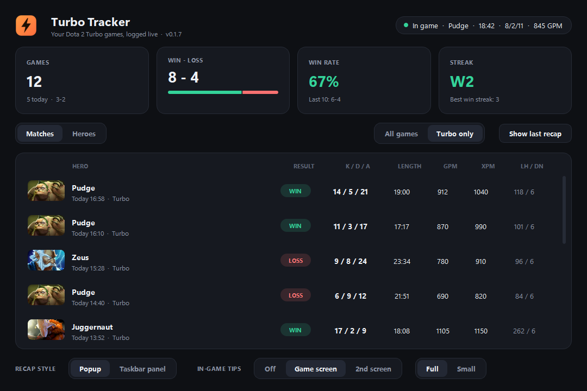
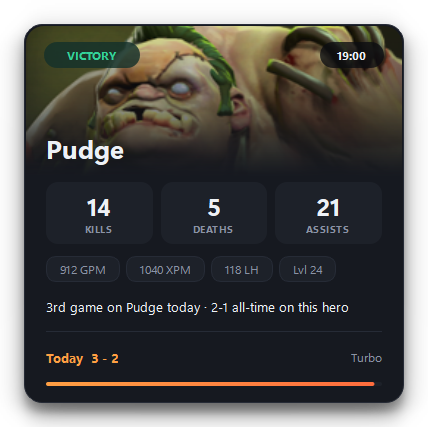
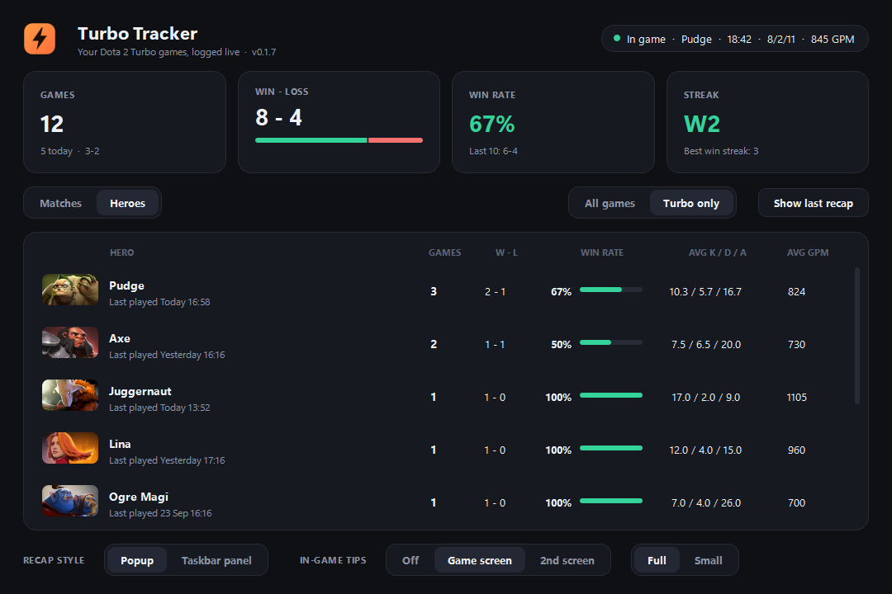
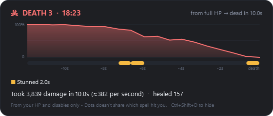
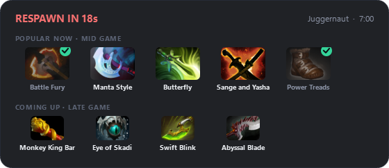

# Turbo Tracker

**Your Dota 2 Turbo games, logged live.** Turbo Tracker records every game
you play, shows a recap card the moment a match ends, and keeps per-hero
stats - for a mode most stat sites barely cover.





When a game ends you get a card like this - result, K/D/A, GPM/XPM, how
many times you've played that hero today and your record on it.

It uses Valve's official **Game State Integration**: Dota itself sends your
own hero's stats to the app on your PC. Turbo Tracker never touches the
game - no input, no memory reading, nothing injected - so it is as safe as
any stats site.

<br clear="right">

## Download

Get the latest from **[Releases](https://github.com/sirawitbm/dota2-turbo-tracker/releases/latest)**:

| File | Pick it if |
| --- | --- |
| `TurboTracker-vX.Y.Z-Setup.exe` | You want a normal install with a Start menu entry. No admin needed. |
| `TurboTracker-vX.Y.Z-windows-x64.zip` | You want a portable copy. Unzip anywhere; data stays in a `data` folder beside the exe. |

Windows **SmartScreen will warn** ("Windows protected your PC") because the
app isn't code-signed. Click **More info > Run anyway**. To check the file
is the one built here, compare its SHA-256 with the `.sha256` file on the
release page:

```powershell
Get-FileHash .\TurboTracker-vX.Y.Z-Setup.exe -Algorithm SHA256
```

## Setup (once)

1. **Steam launch option.** In Steam, right-click **Dota 2 > Properties >
   General > Launch Options** and add:

   ```
   -gamestateintegration
   ```

   Since a March 2022 update, Dota only sends game data with this flag.
2. **Start Turbo Tracker** and click **Set up now** on the yellow banner.
   That writes one small file into Dota's config folder
   (`...\dota 2 beta\game\dota\cfg\gamestate_integration\`) telling Dota
   where to send data.
3. **Restart Dota** if it was open.

The banner disappears once data starts arriving.

Turbo Tracker checks this for you every 20 seconds and tells you (in the
window, and once as a tray notice) if something would stop your games
being logged:

- **Launch option missing** - it reads Dota 2's launch options for the
  Steam account that's logged in (read only), and shows the steps plus a
  **Copy** button for `-gamestateintegration`.
- **Dota running but silent** - usually means Dota was already open when
  the option or connection file was added: restart Dota.

## Using it

Leave Turbo Tracker running while you play. The top-right pill shows what
it sees: *Waiting for Dota*, *Dota is running*, or live **In game** stats.

**Closing the window doesn't quit** - it keeps logging from the **tray
icon** (Windows 11 may tuck it under the **^** by the clock; drag it onto
the taskbar to keep it visible). Click the icon, or just open Turbo
Tracker again from the Start menu, to bring the window back. To quit,
right-click the tray icon > **Quit**.



- **Tiles**: total games (and today), win-loss, win rate (and your last
  10), current streak.
- **Matches / Heroes**: every game, or your record on each hero.
- **All games / Turbo only**: filter the whole window.
- **Recap style**:
  - **Popup** - the card appears bottom-right and closes after 20 seconds
    (hover it to keep it open, click to close).
  - **Taskbar panel** - a small pill on the taskbar beside the clock with
    today's record, and live stats while you play. The recap opens above it
    and stays until clicked. Click the panel to open the window, right-click
    it for more.

    In borderless windowed the taskbar is hidden, so the pill floats over
    Dota's HUD. **Drag it** somewhere it's out of the way; it remembers the
    spot. Right-click > *Move back to the taskbar* to reset it.

    
- **Show last recap** brings back the card for your latest game.
- **In-game tips** (when dead): while you're dead or the game is paused, a small
  card like Dota's pause tips shows the items most bought on your hero at
  this stage of the game - ticked if you already have them - and what's
  coming up next. It disappears the instant you respawn or buy back, and
  it's click-through and never takes focus, so it can't get in the way.
  Pick *Game screen* (top middle), *2nd screen* (if you have one) or
  *Off*, and *Full* (item pictures) or *Small* (one line of text).
  Picking one shows a 6-second preview.

  Dead for a while and want to watch the fight? **Move your mouse onto
  the full card** and it shrinks to one line, or press **Ctrl+Shift+T**
  to switch Full/Small either way. The shortcut only exists while the
  card is showing, so it doesn't take the keys from Dota the rest of the
  time. Your next death starts at your chosen size again.
- **Death recap - Ctrl+Shift+D** during a game shows your latest death:
  your HP over the last seconds, how long you were **stunned, hexed,
  silenced, disarmed or muted** before dying, and how fast you went from
  full HP to dead. Press again to hide (it also hides after 12 s).
  Click-through, like the tips. The shortcut exists only while a game is
  running. It's built from what Dota sends about your own hero - HP and
  disables - so it can't show *which* spell hit you or the damage type:
  Dota doesn't share that with outside apps.

  
- **Finished-item note**: when you complete an item, a small note appears
  on the left where the kill feed is, for 7 seconds: *"Monkey King Bar
  done - Next: Black King Bar, Hurricane Pike, Orchid"*. Also
  click-through. Parts, consumables and neutral items don't count. It
  follows the tips setting (*Off* turns it off too).

  

  The item lists come from OpenDota's popularity data for regular matches
  (Turbo doesn't have its own), with the game stages squeezed to Turbo's
  faster clock. It's what people buy most, not a guaranteed best build.
- **Updates**: at start and every few hours it asks GitHub whether a newer
  release is out. If so, a green banner offers **Download** (opens the
  release page in your browser) or **Later** (stay quiet about that
  version). It never downloads or installs anything by itself.

### How it knows a game was Turbo

Dota's data doesn't say which mode you're playing. So a few minutes after
each game, Turbo Tracker looks the match up on
[OpenDota](https://www.opendota.com) and fills in the mode - until then the
match says *Checking mode...*. **Turbo only** still shows games that are being
checked, so the game you just finished doesn't vanish from the list. Bot and lobby games aren't on OpenDota; after
a few hours of trying they become *Practice / lobby* and never count in
**Turbo only**.

## Known limitations

- **Only your own hero.** As a player, Dota only reports your stats - and
  Turbo Tracker won't try to get anything else.
- **Mode needs OpenDota.** Games only count as Turbo once OpenDota has
  them, which takes a few minutes and needs an internet connection.
- **Primary monitor only** for the popup and the taskbar panel, and the
  panel expects the taskbar at the bottom.
- **Not code-signed**, hence the SmartScreen warning.
- The recap appears after the game, so fullscreen is fine. There's no
  in-game overlay yet (that would need **borderless windowed**).
- No older games yet - importing your history from OpenDota is planned.

## Your data

Everything stays on your PC: in `%LOCALAPPDATA%\TurboTracker` for the
installed version, or the `data` folder beside a portable exe. The only
things sent anywhere are match ids to OpenDota (to look up the mode),
requests for hero item popularity, downloads of hero and item pictures, and a check of this repo's latest
release on GitHub.

To uninstall completely, also delete
`gamestate_integration_turbotracker.cfg` from Dota's
`cfg\gamestate_integration` folder.

## Running from source

Needs Python 3.10+ and PySide6.

```
pip install -r requirements.txt
python turbo_tracker.py
```

- `python -m unittest discover tests` - tests.
- `capture.py` records raw Dota messages to `captures/`; `replay.py` plays
  one back into the running app - handy for testing without playing.
  Captures contain your Steam id; they're git-ignored.
- `tools/screenshots.py` regenerates `docs/` from made-up demo games.
- `.\release.ps1` builds the exe, zip and installer (needs Inno Setup 6).

## How this was made

AI-assisted: built with Claude as a coding agent - I decide what to build,
test it, and use it. Commits carry a `Co-Authored-By` trailer.

## License

MIT - see [LICENSE](LICENSE).
